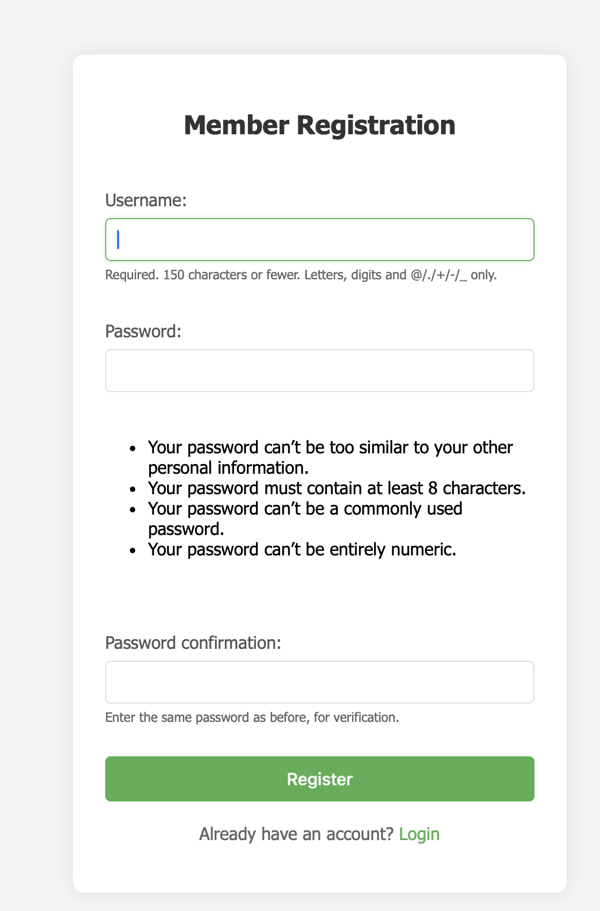

# Grid Layout Editor

A Django-based web application for creating and managing customizable grid layouts. Users can create, save, and manage multiple versions of grid layouts with drag-and-drop functionality.


---

## Features

- **Interactive Grid Editor**
  - Drag and drop grid placement
  - Resize grids with handles
  - Collision detection between grids
  - Double-click to delete grids

- **User Management**
  - User registration and authentication
  - Personal layout storage for each user
  - Secure access to saved layouts

- **Layout Management**
  - Save multiple versions of layouts
  - Automatic version naming (layout-0, layout-1, etc.)
  - View and load previous layouts
  - Delete unwanted layouts

---

## Screenshots

### Grid Editor Interface


### Layout Versions Management
<!--  -->

### User Registration


---

## Installation

### Prerequisites
- Python 3.10+
- Git

### Steps

1. **Clone the repository**
   ```bash
   git clone https://github.com/sprigga/grid_layout_assignment.git
   cd grid_layout
   ```

2. **Create and activate a virtual environment**
   ```bash
   python -m venv venv
   source venv/bin/activate  # For Unix/macOS
   venv\Scripts\activate     # For Windows
   ```

3. **Install dependencies**
   ```bash
   pip install -r requirements.txt
   ```

4. **Apply database migrations**
   ```bash
   python manage.py makemigrations
   python manage.py migrate
   ```

5. **Create a superuser (optional)**
   ```bash
   python manage.py createsuperuser
   ```

6. **Run the development server**
   ```bash
   python manage.py runserver
   ```

7. **Access the application**
   Open your browser and navigate to `http://127.0.0.1:8000`.

---

## Usage

1. **Login/Registration**
   - Register a new account or log in with existing credentials.
   - Access your personal grid layouts.

2. **Grid Editor**
   - Add grids using the "Add Grid" button.
   - Drag and resize grids on the canvas.
   - Save your layout using the "Save Layout" button.

3. **Layout Versions**
   - View saved layouts in the "Layout Versions" page.
   - Load or delete specific layout versions.

---

## Project Structure

```
grid_layout/
├── db.sqlite3               # SQLite database
├── manage.py                # Django management script
├── README.md                # Project documentation
├── requirements.txt         # Python dependencies
├── grid_app/                # Main application
│   ├── migrations/          # Database migrations
│   ├── static/              # Static files (CSS, JS)
│   │   └── js/
│   │       └── grid_editor.js  # Frontend logic
│   ├── templates/           # HTML templates
│   │   ├── grid_editor.html   # Main editor page
│   │   ├── layout_versions.html  # Layout history page
│   │   ├── login.html         # Login page
│   │   └── register.html      # Registration page
│   ├── models.py            # Database models
│   ├── views.py             # Application views
│   ├── urls.py              # URL routing
│   └── admin.py             # Admin configuration
└── grid_layout/             # Project settings
    ├── settings.py          # Django settings
    ├── urls.py              # Project URL routing
    ├── wsgi.py              # WSGI configuration
    └── asgi.py              # ASGI configuration
```

---

## API Endpoints

- `GET /`: Grid editor interface
- `POST /save-grid-layout/`: Save current grid layout
- `GET /get-grid-layout/`: Retrieve saved grid layout
- `GET /layout-versions/`: View layout version history
- `POST /delete-layout-version/<id>/`: Delete specific layout version

---

## Contributing

1. Fork the repository.
2. Create your feature branch (`git checkout -b feature/AmazingFeature`).
3. Commit your changes (`git commit -m 'Add some AmazingFeature'`).
4. Push to the branch (`git push origin feature/AmazingFeature`).
5. Open a Pull Request.

---

## License

This project is licensed under the MIT License - see the [LICENSE](LICENSE) file for details.

---

## Contact

sprigga - [sprigga@gmail.com](mailto:your.email@example.com)

Project Link: [https://github.com/sprigga/grid_layout_assignment](https://github.com/sprigga/grid_layout_assignment)
